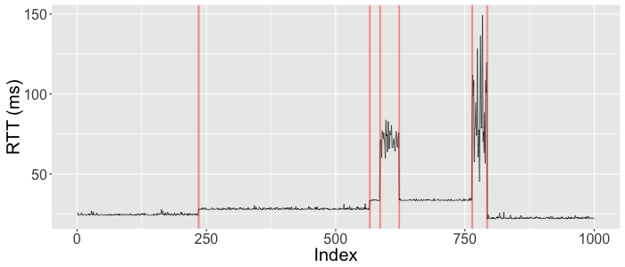

# What is it about?
Generate artificial Internet Round-Trip Time time series.

# How to use it?
With the __rtt.gen__ function provided in [rtt_gen.R](rtt_gen.R), one can
generate random RTT traces of a given length.

```R
require(ggplot2)
# in the same folder of rtt_gen.R
source('rtt_gen.R')
# generates random RTT trace having 1000 data points
sample.rtt <- rtt.gen(1000)
# visualize the generated trace
g <- ggplot(rtt, aes(x=seq_len(nrow(rtt)), y=trace)) +
    geom_line(size=.3) +
    geom_vline(xintercept = which(rtt$cpt == 1), col='red', size=1, alpha=.4) +
    xlab("Index") +
    ylab("RTT (ms)") +
    theme(text=element_text(size=20))
print(g)
```

__sample.rtt$trace__ contains the RTT trace, while in __sample.rtt$cpt__
indexes where a significant change happens to the generated RTT trace are flagged
to 1. 

With the above code, one can obtain an instantly generated RTT time series,
marked with moments when changes take place (red vertical lines).



# How RTT trace is generated?
Two types of changes are simulated: stage-like change due to path change and
RTT deviation from baseline caused by long during congestion. 
The generation follows the steps given below:

1. generate the number of stages;
2. generate the length for each stage;
3. generate the RTT baseline value for each stage;
4. add additional noises/deviation to the RTT baseline;
5. add relatively long during congestion.
